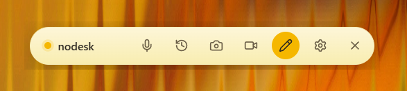

# nodesk

A lightweight, always-on-top desktop note widget built with Tauri 2 + React. Sits quietly in the corner of your screen, ready whenever you need it.



---

## Features

- **Floating pill widget** — always-on-top, borderless, draggable. Stays out of the taskbar.
- **Rich text editor** — TipTap-powered with headings, lists, to-do checkboxes, quotes, code blocks, highlights, and links.
- **Voice notes** — press the mic button (or `Ctrl+Shift+V` / `F9` push-to-talk) to dictate. Transcribed via Groq Whisper, then auto-corrected by your AI provider.
- **AI text fixing** — fix grammar, shorten, expand, or reformat — powered by OpenRouter or a local Ollama model.
- **Note history** — searchable list of all saved notes with tag filtering.
- **Screenshot capture** — grab the full screen, annotate with text, arrows, rectangles, and blur, then save or copy to clipboard.
- **Screen recorder** — record the full screen or a custom region as MP4 or GIF (requires FFmpeg).
- **System tray** — minimizes to tray on close; toggle visibility from the tray icon or left-click.
- **Auto-start with Windows** — optional, toggled from Settings.
- **Local SQLite storage** — all notes stored on-device, no cloud dependency.
- **Dual AI backends** — OpenRouter (cloud) or Ollama (local/private).

---

## Installation

### Pre-built installer

Download the latest release from [GitHub Releases](https://github.com/palamut62/nodesk/releases) and run:

```
nodesk_0.1.0_x64-setup.exe
```

No extra dependencies needed — WebView2 is already bundled in Windows 11.

### Build from source

**Prerequisites**
- [Node.js 20+](https://nodejs.org)
- [Rust (stable)](https://rustup.rs)
- [Tauri CLI prerequisites](https://tauri.app/start/prerequisites/)
- FFmpeg in PATH (optional — required for screen recording)

```bash
git clone https://github.com/palamut62/nodesk.git
cd nodesk
npm install
cp .env.example .env   # fill in your keys
npm run tauri dev
```

**Production build**

```bash
npm run tauri build
# Output: src-tauri/target/release/bundle/
```

---

## Configuration

Create a `.env` file in the project root (see `.env.example`):

```env
# AI text fixing (OpenRouter - https://openrouter.ai)
OPENROUTER_API_KEY=sk-or-v1-...
OPENROUTER_MODEL=openai/gpt-4o-mini

# Voice transcription (Groq Whisper - https://console.groq.com, free tier available)
GROQ_API_KEY=gsk_...

# Optional: use a local Ollama model instead of OpenRouter
# AI_PROVIDER=ollama
# OLLAMA_BASE_URL=http://127.0.0.1:11434
# OLLAMA_MODEL=llama3
```

All settings can also be configured at runtime from the **Settings** panel inside the app. API keys are stored locally in the app data directory.

---

## Keyboard Shortcuts

| Shortcut | Action |
|----------|--------|
| `Ctrl+Shift+V` | Toggle voice recording |
| `F9` (hold) | Push-to-talk voice note |
| `Ctrl+S` | Save note (inside editor) |
| `Escape` | Close editor / cancel |

---

## Tech Stack

| Layer | Technology |
|-------|-----------|
| Desktop shell | [Tauri 2](https://tauri.app) (Rust + WebView2) |
| Frontend | React 19 + TypeScript + Vite |
| Rich text | [TipTap](https://tiptap.dev) (ProseMirror) |
| Database | SQLite via `rusqlite` (bundled) |
| HTTP | `reqwest` (Rust) |
| AI text | [OpenRouter](https://openrouter.ai) / [Ollama](https://ollama.com) |
| Transcription | [Groq Whisper](https://console.groq.com) |
| Auto-start | `tauri-plugin-autostart` |
| Global shortcuts | `tauri-plugin-global-shortcut` |

Bundle size: ~5 MB installer, ~20 MB installed.

---

## Project Structure

```
nodesk/
├── src/                     # React frontend
│   ├── main.tsx             # App root
│   ├── Widget.tsx           # Floating pill widget
│   ├── Editor.tsx           # Rich text editor
│   ├── History.tsx          # Note history list
│   ├── Settings.tsx         # Settings panel
│   ├── Recorder.tsx         # Screen recorder (MP4/GIF)
│   ├── ScreenshotEditor.tsx # Screenshot annotation
│   ├── lib/tauri.ts         # Tauri invoke wrappers
│   └── styles/apple.css     # Apple Notes-inspired theme
├── src-tauri/
│   ├── src/
│   │   ├── lib.rs           # Tauri commands + app setup
│   │   ├── db.rs            # SQLite note storage
│   │   ├── openrouter.rs    # OpenRouter API client
│   │   ├── ollama.rs        # Ollama API client
│   │   ├── whisper.rs       # Groq Whisper transcription
│   │   ├── recorder.rs      # FFmpeg screen recording
│   │   ├── screenshot.rs    # Screen capture
│   │   └── settings.rs      # Persistent settings store
│   └── tauri.conf.json
├── assets/
│   └── preview.png
├── .env.example
└── package.json
```

---

## License

MIT
